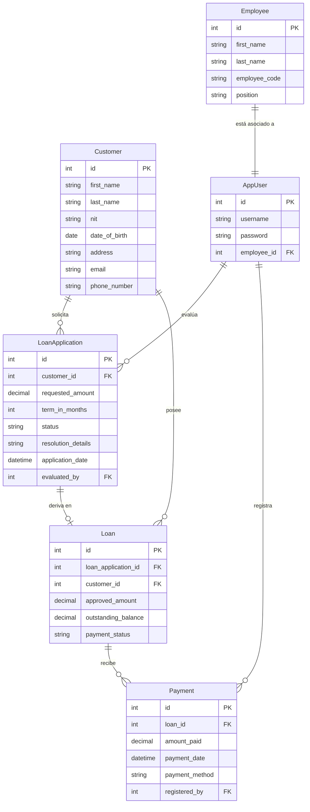

# CHN Examen (Monorepo)

Este repositorio es un monorepo que define y orquesta la solución completa del examen, uniendo tanto el Frontend como el Backend en una sola infraestructura desplegable mediante contenedores.

## 🚀 Tecnologías Usadas

- **Frontend:** Angular 21 (TypeScript), sirviendo la SPA a través de un servidor ligero Nginx.
- **Backend:** Java 21, Spring Boot 3, Spring Security (JWT), Hibernate/JPA.
- **Base de Datos:** Microsoft SQL Server 2022.
- **Infraestructura:** Docker y Docker Compose para orquestación e inicialización.

## ⚠️ Pre-requisitos y Advertencias

Para poder levantar este proyecto sin errores, es indispensable contar con **Docker** y **Docker Compose** instalados. 

> **IMPORTANTE:** Asegúrate de que los siguientes puertos de tu máquina local estén completamente libres (detén instancias locales de SQL Server, de NodeJS u otros servidores que los puedan estar ocupando temporalmente):
> - **Puerto `1433`**: Es estrcitamente requerido por el contenedor de la base de datos SQL Server.
> - **Puerto `8080`**: Usado por la API de Spring Boot.
> - **Puerto `4200`**: Usado por Nginx para publicar el cliente de Angular.

## 🛠️ Levantar todo con Docker Compose

1. Copia variables de entorno:

```bash
cp .env.example .env
```

2. Levanta base de datos e inicializa esquema/datos:

```bash
docker compose up -d db
docker compose run --rm db-init
```

3. Levanta API y Web:

```bash
docker compose up -d --build api web
```

Servicios levantados:

- Frontend: `http://localhost:4200`
- Backend API: `http://localhost:8080/api`
- SQL Server: `localhost:1433`

> **🔑 Credenciales de acceso:** 
> Una vez levantado el proyecto web, puedes iniciar sesión con las cuentas por defecto inyectadas en la base de datos:
> - **Usuario:** `admin`
> - **Contraseña:** `admin`

## 🔗 Repositorios Originales

Este proyecto consolida el código de los siguientes repositorios individuales que en su momento formaron el alcance del examen:
- **Web (Angular):** [https://github.com/ernestojv/chn-examen-web](https://github.com/ernestojv/chn-examen-web)
- **API (Spring Boot):** [https://github.com/ernestojv/chn-examen-api](https://github.com/ernestojv/chn-examen-api)

## 🏗️ Arquitectura y Detalles del Proyecto

### Capa Frontend (Angular + Nginx)
La capa web fue desarrollada como una aplicación del lado del cliente (_SPA_) en Angular. El contenedor Docker cuenta con un compilado tipo _multi-stage_ apoyado por Node.js y expone permanentemente los últimos "assets" en **Nginx**. Dicho de otro modo, Nginx no solo responde por la interfaz gráfica, se configuró como un *Proxy Inverso* para redirigir las solicitudes que inician por `/api` hacia el backend en Spring Boot, lo cual evita problemas convencionales de solicitudes CORS.

### Capa API y Backend (Spring Boot)
Construido bajo una arquitectura modelo de capas, hace uso de la abstracción de Data JPA para el acceso a datos. Protege las rutas web mediante **Spring Security y JWT**. La validación extrae y confía en el header `Authorization: Bearer <token>` proveído por el inicio de sesión. 
 
### Base de Datos y DB-Init (SQL Server)
Empleamos la imagen base oficial `mssql/server:2022-latest`. El compose incluye un servicio estratégico complementario `db-init` que depende de comandos directos a `mssql-tools`.
- Se encarga de correr las precondiciones con `chn-examen-api/script.sql`.
- El script de creación es **idempotente** (utiliza sentencias `IF NOT EXISTS` repetidamente), lo que significa que crea las tablas relacionales y el usuario de inicio ('Admin') únicamente si no han sido detectadas, siendo seguro reiniciarlo.

#### Diagrama de Entidad-Relación (ERD)



```bash
docker compose down -v
docker compose up -d db
docker compose run --rm db-init
docker compose up -d --build api web
```
